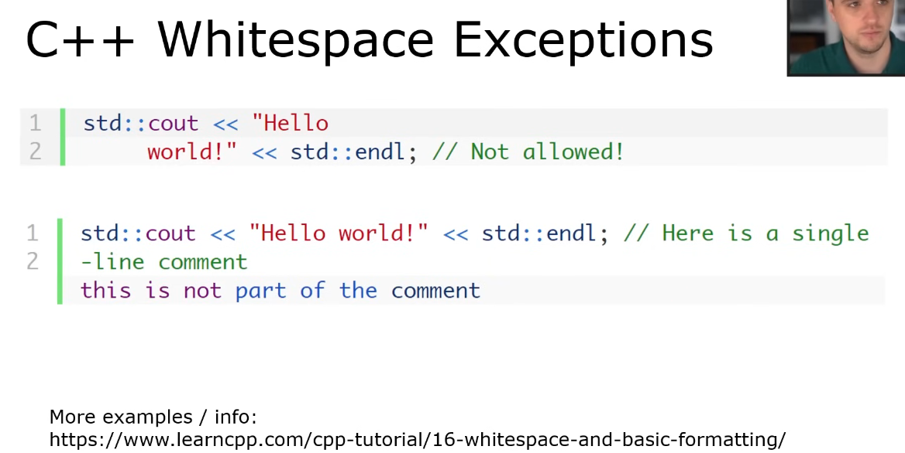

## c++ references

- learncpp.com
  - excellent tutorial, step by step
- en.cppreference.com/w/
  - go-to reference for libraries / functions
- cplusplus.com/doc/tutorial/

## what is c++

- C++ is a programming language that focus on runtime speed and and functionality
- is a complied language
- mid to low level programming language
  - high level = python
  - low level = assembly

## advantages

- Very widely used / supported
- Many libraries available
- Resulting code is very fast
- Syntax is similar to Java / other lang
- C++ programmers get hired
- Code is highly customizable
- C++ will be around for a long time

## Disadvantages of C++

- Easy to write unsafe code / crashes
- Must manage your own memory
- Syntax can be a little confusing
- Can be hard to read others' code due to
- custom definitions / op overloading
- Compiler/linker errors hard to interpret

# C Programming Language

- *Created by Dennis Ritchie, Bell Labs
- *Available on nearly every possible
- *Procedural, low-mid level language
- *No object oriented programming
- *Popular for: system software, drivers
- embedded, OS, etc
- Greatly influenced development of C++

## C++ Programming Language

* Created by Bjarne Stroustrup, Bell Labs
* Originally "C with Classes", C++ 1983
* Procedural "superset of C" (exceptions)
* Supports object-oriented and
* Maintains the efficiency of C
* Very popular in video game development
* Influenced development of C# and Java

## C++ Versions

* First appeared in 1985
* C++98 - First Standardized Version
* C++ll - Many new features / QOL
* C++14, C ++17, C ++20
* We will use C++17 in this course
  * Nice new functionality over C++98
  * Compiler flag: std=C++17

## C++ Properties

* C++ is statically typed.
* Variables defined/typed before use
  * int year = 2018;
  * Java, C also statically typed
  * Variable types defined at compile-time
* Python is dynamically typed
  * num = 10
* Variable types defined at run-time

## Your First C++ Program

```#include
#include <iostream>
int main(int argc, char * argv)
{
    std::cout << "Hello, world \n";  
    return 0;
}
```

## #include `<iostream>`

* The first line is a pre-processor directive (more about pre-processor later)
* It is used to include a C++ library
* This particular library is used for input /
  output streams

## int main(int argc, char * argv[])

Each C++ program must have a main
function which is run when program starts

* Contents of the function enclosed in { }
* Main function has int return type
* argc = number of program args
* argv = array of string (char *) args
  * Very similar to Java's main(string args[])

## std:: cout << "Hello, world! \ n"

* This line prints string "Hello, World!\n"
* std is a namespace (more later) that contains the cout output stream
* The << operator 'pipes' the string to cout
* Can be used to print any base C++ type
* Each C++ statement must end in ;
* C++ is case-sensitive

## return 0;

* Main has return type of int
  * the system calls main
* Return 0 if program ran to normal end
* Return something else if there is an error
  * Used by other programs to detect errors
* Program may compile / run without this, but it is highly recommended to use it

# C++ whitespace

* For the most part, doesn't matter
* exceptions you cannot separate strings or single line comments
* 

# C++ Indentation / braces

* you have to sue the style of the company  you are working for
* we will use allman style

# C++ standard Library

* Collection of classes and functions available within the C++ language
* Example Functionality
* Strings / IO / Streams / Files
* Generic Containers (vector, set, map)
* Container Functionality (fill, copy, erase)
* Algorithms (sort, max/min)
* Must #include in your C++ program
* Referenced via the std:: namespace
* Namespaces encapsulate code
* namespace dave { int i va10; }
  * Outside usage: dave:: i var
* Standard library examples:
  * std: : string, std: : vector, std:: map
* Collection of classes and functions available within the C++ language
* Example Functionality
  * Strings / IO / Streams / Files
  * Generic Containers (vector, set, map)
  * Container Functionality (fill, copy, erase)
  * Algorithms (sort, max/min)
  * Must #include in your C++ program
* Referenced via the std:: namespace
* Namespaces encapsulate code
  * namespace dave { int i var 10;}
  * Outside usage: dave: : ivar
* standard library examples
  * std: : string, std: : vector, std: : map

## C + + Source Code

* Program Code written in .cpp files
  * Example: main.cpp
  * Also named .C .CPP - we will use .cpp
  * Used for function / class definitions
* Header Files written in .h files
  * Example: math.h, MyClass.h
  * Used for function / class declarations
